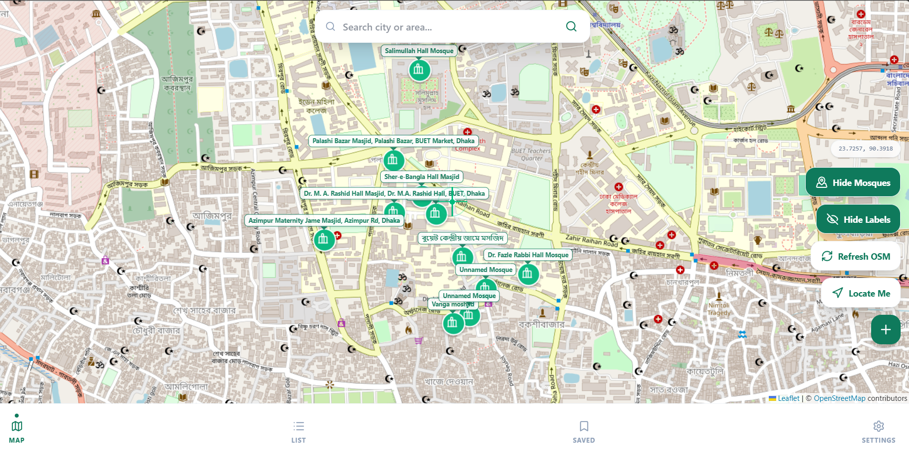
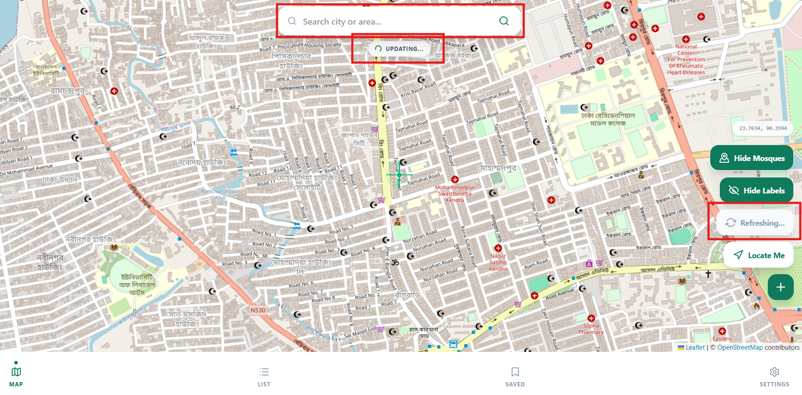
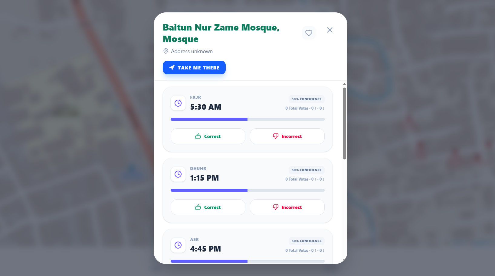

# 🕌 SalahMap

**SalahMap** is a community-powered mosque finder and Prayer time tracker. It helps Muslims find nearby mosques, view crowd-verified prayer (Jamat) times, and contribute by updating and voting on prayer schedules — all from their phone.
🔗 Live Demo: https://salahmap.netlify.app

📸 Screenshots





---

## 🌟 Features

- 📍 **Mosque Finder** — Detects your location and shows mosques near you on an interactive map
- 🕐 **Jamat Time Display** — View prayer/Jamat times for each mosque listed
- ✏️ **Community Updates** — Users can submit and update Jamat times directly from their phone via the website
- ✅ **Voting System** — Users can upvote or downvote submitted times to verify their accuracy
- 📱 **Mobile Friendly** — Fully usable on any smartphone browser, no app install needed
- And many more... 

---
## 📖 How to Use
 
### 🔍 Finding Mosques Near You
1. Open [SalahMap](https://salahmap.netlify.app) on your phone or browser
2. When prompted, **allow location access** so the app can find mosques near you
3. Mosques in your area will appear on the map and as a list below it
4. Tap any mosque to see its details
 
### 🕐 Viewing Jamat Times
1. Tap on a mosque from the map or the list
2. The mosque's **Jamat (prayer) times** will be displayed
3. You can also see how many users have **verified** the times
 
### ✏️ Updating Jamat Times
1. Select a mosque
2. Tap **"Update All Prayer Time"**
3. Enter the correct prayer times
4. Submit — your update will be visible to other users immediately
 
### 👍 Voting on Times
1. View the Jamat times for any mosque
2. Tap **👍 (correct)** if the time is accurate or **👎 (incorrect)** if it's wrong
3. The community vote helps others know which times are trustworthy
 
> 💡 **Tip:** No account needed! Anyone can view mosques and Jamat times. Updates and votes are open to all users to keep it simple and accessible.
 
---
 yone can view mosques and Jamat times. Updates and votes are open to all users to keep it simple and accessible.

## 🛠️ Tech Stack

| Layer | Technology |
|---|---|
| Frontend | HTML / CSS / JavaScript (Vite) |
| AI Features | Google Gemini API |
| Backend / Database | Supabase |
| Map Data | OpenStreetMap (OSM) |
| Hosting | Netlify |

---

## 🚀 Getting Started (Local Development)

### Prerequisites
- Node.js installed
- A Supabase account and project
- A Google Gemini API key

### 1. Clone the repository
```bash
git clone https://github.com/IstiakAdnan114/salahmap.git
cd salahmap
```

### 2. Install dependencies
```bash
npm install
```

### 3. Set up environment variables
Create a `.env` file in the root of the project and add the following:

```env
VITE_SUPABASE_URL=your_supabase_project_url
VITE_SUPABASE_ANON_KEY=your_supabase_anon_key
VITE_GEMINI_API_KEY=your_gemini_api_key
```

> ⚠️ Never commit your `.env` file to GitHub. It is already listed in `.gitignore`.

### 4. Run the development server
```bash
npm run dev
```

---

## 🌐 Deployment (Netlify)

This project is deployed on Netlify. To deploy your own version:

1. Push your code to GitHub
2. Connect the repo to [Netlify](https://netlify.com)
3. Go to **Site Configuration → Environment Variables** and add:
   - `VITE_SUPABASE_URL`
   - `VITE_SUPABASE_ANON_KEY`
   - Your Gemini API key variable
4. Trigger a redeploy

---

## 🗄️ Supabase Setup

1. Create a new project at [supabase.com](https://supabase.com)
2. Create a table for mosques and Jamat times (with fields for mosque name, location, prayer times, votes, etc.)
3. Enable **Row Level Security (RLS)** policies as needed to allow public reads and authenticated writes
4. Copy your **Project URL** and **anon key** from **Project Settings → API**

---

## 🤝 Contributing

Contributions are welcome! If you know of a mosque or incorrect Jamat time, you can update it directly through the website. For code contributions:

1. Fork the repo
2. Create a new branch (`git checkout -b feature/your-feature`)
3. Commit your changes
4. Open a Pull Request

---

## 🙏 Acknowledgements

- [OpenStreetMap](https://www.openstreetmap.org/) for mosque location data
- [Supabase](https://supabase.com/) for the backend
- [Google Gemini](https://ai.google.dev/) for AI features
- [Netlify](https://netlify.com/) for hosting

---

## 📄 License

This project is open source and available under the [MIT License](LICENSE).

---

> *Built with the intention of making it easier for Muslims to find their nearest mosque and prayer times. May it be of benefit. 🤲*
